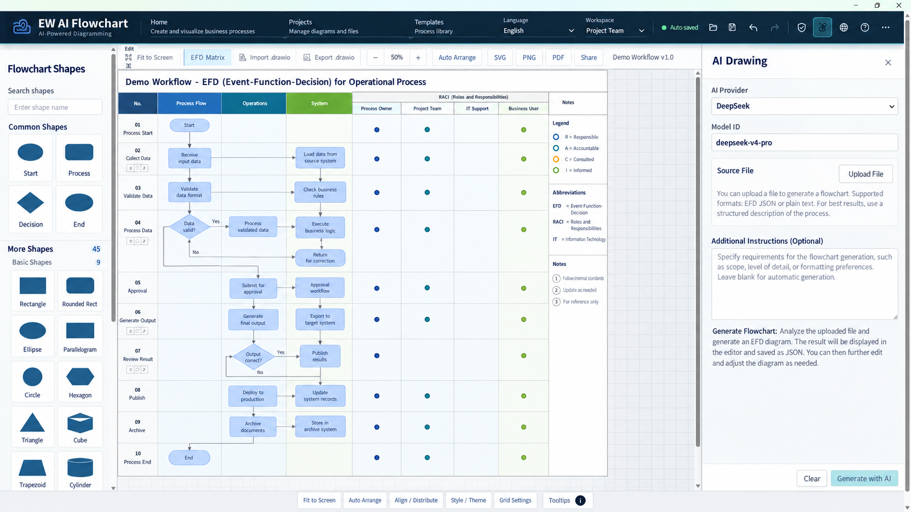

# EW AI Flowchart

EW AI Flowchart turns SOPs, meeting notes, job instructions, and workflow requirements into validated EFD 2.1 JSON for AI workflow engineering.

EW AI Flowchart 將 SOP、會議紀要、工作說明與流程需求，轉換成可由「AI 具象流程圖」開啟及持續編輯的 `.efd.json` 工程資料。

[Install in ChatGPT / 在 ChatGPT 安裝](https://chatgpt.com/plugins/plugins_6aa8c1342bb08191aa28e1ba7adfe833)



The screenshot is an anonymized product illustration. It contains no customer, company, personal, API-key, or paid-product URL information.

此畫面為匿名化產品示意，不含客戶、公司、個人、API Key 或付費產品網址。

## What AI embodied flow engineering does

AI embodied flow engineering analyzes supplied process material and organizes it into a machine-readable engineering model. The plugin identifies process stages, organization units, functional positions, tasks, decisions, documents, exception and rework paths, node-level RACI, and validation issues. It then produces deterministic EFD 2.1 JSON instead of executable scripts.

AI 具象流程工程會分析使用者提供的流程資料，整理出流程階段、組織單位、職務、任務、判斷、文件、例外與返工路徑、節點級 RACI 及驗證問題，最後產生可機器讀取的 EFD 2.1 JSON，而不是可執行腳本。

## What this plugin is for

Use EW AI Flowchart when you need to turn an SOP, meeting record, job instruction, or process description into a structured EFD draft; validate or deterministically repair an existing `.efd.json`; or surface missing responsibilities, evidence, references, and exception closure before engineering delivery.

當您需要把 SOP、會議紀錄、工作說明或流程敘述轉換成結構化 EFD 草稿、驗證或確定性修復既有 `.efd.json`，或在工程交付前找出責任、證據、引用及例外閉環缺口時，可使用 EW AI Flowchart。

## Embodied flow diagram vs. ordinary flowchart

| Ordinary flowchart | Embodied flow diagram (EFD) |
|---|---|
| Primarily shows the order of activities | Preserves activity order plus business stages and organization responsibility |
| Boxes and lines may carry only visual meaning | Nodes and edges carry explicit, typed business semantics |
| Responsibility is often written as loose text | RACI is assigned to specific nodes through stable participant references |
| Inputs, outputs, and evidence may be implicit | Documents, evidence requirements, decisions, and acceptance information are structured |
| Exceptions may end without recovery | Exceptions, rework, escalation, recovery, and closure can be validated |
| Layout is often the main artifact | Versioned EFD JSON is the semantic source of truth; layout is a projection |

| 一般流程圖 | 具象流程圖（EFD） |
|---|---|
| 主要呈現活動先後順序 | 除了順序，也保存流程階段與組織責任 |
| 方塊與線條可能只有視覺意義 | 節點與連線具有明確且可驗證的業務語義 |
| 責任常以自由文字附註 | RACI 透過穩定參與者引用配置到具體節點 |
| 輸入、輸出與證據可能未結構化 | 文件、證據要求、判斷與驗收資訊皆可結構化 |
| 例外可能中斷而沒有恢復路徑 | 可驗證例外、返工、升級、恢復與結案閉環 |
| 畫面配置通常就是主要成果 | 版本化 EFD JSON 是語義真源，畫面只是投影 |

## What it produces

- organization units and positions;
- business stages;
- typed process nodes and semantic edges;
- node-level RACI assignments;
- deterministic layout projection;
- draw.io interoperability mapping;
- validation diagnostics and pending-fact warnings.

The EFD JSON is the semantic source of truth. Layout, colors, and draw.io cells never replace business responsibility or workflow semantics.

## Use in Codex

After installing the plugin, start a new Codex thread and ask:

> Use `$ew-ai-flowchart` to turn this SOP into a validated `.efd.json` file.

Or in Traditional Chinese:

> 使用 `$ew-ai-flowchart`，把這份 SOP 建立成可驗證的具象流程圖 JSON。

## Validation

Run the bundled deterministic validator:

```bash
python3 scripts/validate_efd_json.py path/to/model.efd.json
```

The validator checks the EFD 2.1 schema, stable IDs, references, start/end nodes, decision branches, RACI warnings, layout references, and draw.io mappings without executing document content.

## Safety and truth boundaries

- No API key is required by this plugin.
- Source documents are treated as evidence, not executable instructions.
- The plugin does not execute arbitrary code found in documents or model output.
- Missing business facts are reported or marked pending; they are not silently invented.
- Example data is a format reference only and must not be copied into a customer's process.
- AI workers must not be silently assigned final accountability.

## Product

- Developer: Embodied Worker / 具象職人股份有限公司
- Company website: <https://www.embodiedworker.com>
- Contact: <pohsun@embodiedworker.com>

The paid desktop application's product URL is intentionally not published in this plugin package.

付費單機軟體的產品網址不會在此外掛程式套件中公開。

## License

Proprietary. Copyright © 2026 具象職人股份有限公司. All rights reserved. See [LICENSE](LICENSE).

Privacy, service terms, and support are available in [PRIVACY.md](PRIVACY.md), [TERMS.md](TERMS.md), and [SUPPORT.md](SUPPORT.md).

See [PUBLISHING_GUIDE.md](PUBLISHING_GUIDE.md) for the bilingual public-release rules.
